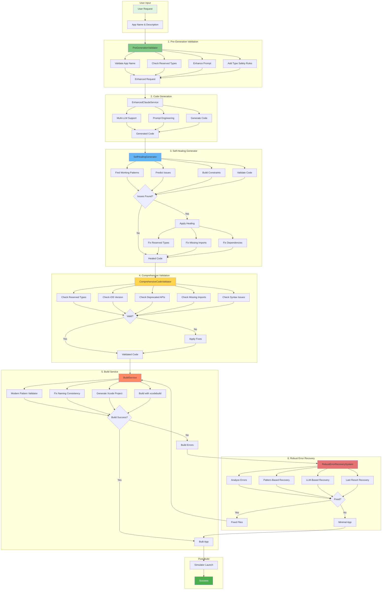

# SwiftGen Error Handling and Validation Architecture

## Overview

SwiftGen employs a comprehensive multi-layer error handling and validation system that ensures generated iOS apps compile and run successfully. The system consists of six main components that work together in a specific sequence.

## Architecture Diagram



## Component Details

### 1. Pre-Generation Validation (PreGenerationValidator)
**When:** Before any code generation
**Purpose:** Prevent common issues before they occur
**Key Functions:**
- Validates app name and description
- Checks for problematic app types (todo, task, timer, etc.)
- Adds warnings about reserved Swift types
- Enhances prompts with type safety rules
- Suggests replacements for reserved types

**Example Issues Prevented:**
- Using `Task` instead of `TodoItem` (Task is a Swift generic)
- Using `State` instead of `AppState` (conflicts with @State)
- Using reserved Foundation/SwiftUI types

### 2. Code Generation (EnhancedClaudeService)
**When:** After pre-validation
**Purpose:** Generate iOS app code using multiple LLMs
**Key Functions:**
- Supports multiple LLM providers (Claude, GPT-4, xAI)
- Uses enhanced prompts from pre-validation
- Applies prompt engineering for better results
- Handles multi-file app generation

### 3. Self-Healing Generator (SelfHealingGenerator)
**When:** Immediately after generation
**Purpose:** Predict and fix issues before building
**Key Functions:**
- Learns from successful app patterns
- Predicts potential issues based on description
- Validates generated code
- Applies automatic healing strategies
- Fixes phantom dependencies
- Ensures all files have proper imports
- Creates minimal working app as last resort

**Healing Strategies:**
- Fix reserved type conflicts
- Add missing imports
- Remove phantom service dependencies
- Fix string literal issues
- Fix deprecated environment usage

### 4. Comprehensive Code Validator (ComprehensiveCodeValidator)
**When:** After self-healing, before build
**Purpose:** Deep validation of Swift/SwiftUI code
**Key Functions:**
- Validates against iOS target version (16.0)
- Checks for reserved generic types
- Validates Foundation/SwiftUI type usage
- Checks for deprecated APIs
- Ensures required imports are present
- Detects syntax issues
- Provides automatic fixes

**Categories Checked:**
- Reserved types (generic, foundation, UI)
- iOS version compatibility
- Deprecated API usage
- Missing imports
- Protocol conformance
- Syntax errors

### 5. Build Service with Post-Generation Validation
**When:** During build process
**Purpose:** Build validation and modern pattern checking
**Key Functions:**
- Modern pattern validation (ModernPatternValidator)
- Swift syntax validation
- Naming consistency fixes
- XcodeGen project generation
- xcodebuild compilation
- Multiple build attempts with recovery

**Build Flow:**
1. Validate Swift syntax
2. Check modern Swift patterns
3. Auto-fix critical issues
4. Fix naming consistency
5. Generate Xcode project
6. Attempt build (up to 3 times)
7. Launch in simulator if successful

### 6. Robust Error Recovery System
**When:** After build failure
**Purpose:** Intelligent multi-strategy error recovery
**Key Functions:**
- Analyzes build errors
- Categorizes errors by type
- Applies pattern-based fixes
- Uses LLM-based recovery (Claude, GPT-4)
- Implements last resort recovery
- Tracks attempted fixes to avoid loops

**Recovery Strategies:**
1. **Pattern-Based Recovery:**
   - iOS version compatibility fixes
   - String literal corrections
   - Module import fixes
   - PersistenceController removal
   - Protocol conformance fixes

2. **LLM-Based Recovery:**
   - Uses Claude/GPT-4 to understand and fix errors
   - Provides context-aware fixes
   - Handles complex error patterns

3. **Last Resort Recovery:**
   - Creates minimal working app
   - Ensures at least basic functionality

## Error Flow Example

```
1. User requests "Todo app with task management"
   ↓
2. PreGenerationValidator warns: "Use TodoItem not Task"
   ↓
3. Enhanced prompt sent to Claude with constraints
   ↓
4. Code generated with proper types
   ↓
5. SelfHealingGenerator checks for missing imports
   ↓
6. ComprehensiveCodeValidator ensures iOS 16.0 compatibility
   ↓
7. BuildService attempts build
   ↓
8. If build fails, RobustErrorRecoverySystem fixes errors
   ↓
9. Retry build with fixed code
   ↓
10. Launch in simulator
```

## Key Features

### Intelligent Error Prevention
- Proactive validation before generation
- Pattern learning from successful apps
- Constraint-based generation

### Multi-Layer Validation
- Pre-generation validation
- Post-generation validation
- Build-time validation
- Runtime validation

### Automatic Recovery
- Pattern-based fixes for common errors
- AI-powered fixes for complex issues
- Fallback to minimal working app

### Loop Prevention
- Tracks attempted fixes
- Limits recovery attempts
- Prevents infinite loops

## Success Metrics

The system achieves high success rates by:
1. **Prevention:** ~70% of issues prevented by pre-validation
2. **Self-Healing:** ~20% of issues fixed automatically
3. **Recovery:** ~8% of issues fixed during build
4. **Minimal App:** ~2% fallback to minimal template

## Configuration

### iOS Target Version
- Default: iOS 16.0
- Configurable in ComprehensiveCodeValidator

### Max Recovery Attempts
- Build attempts: 3
- Recovery attempts per error pattern: 2

### Supported Error Types
- iOS version compatibility
- Reserved type conflicts
- Missing imports
- String literal errors
- Module import errors
- Protocol conformance
- Syntax errors